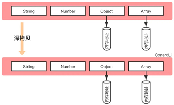

[如何写出一个惊艳面试官的深拷贝?](https://juejin.cn/post/6844903929705136141)  
[JS 从零手写一个深拷贝](https://www.cnblogs.com/echolun/p/16157161.html)

## 1. 浅拷贝

浅拷贝一个对象时，如果属性是基本类型，拷贝的就是基本类型的值，如果属性是引用类型，拷贝的就是内存地址，所以如果原对象或拷贝后的对象改变了引用类型的值，就会影响到另一个对象。


### 1.1 object.assign()

它不会拷贝对象的继承属性，不会拷贝对象的不可枚举的属性；
可以拷贝 Symbol 类型的属性。

```javascript
const cloneObj = Object.assign({}, obj);
```

```javascript
let obj1 = { a: { b: 1 }, [Symbol(1)]: 1 };
Object.defineProperty(obj1, "innumerable", {
  value: "不可枚举属性",
  enumerable: false,
});

let obj2 = Object.assign({}, obj1);
obj1.a.b = 2;
console.log(obj1); // {a: {b: 2}, innumerable: '不可枚举属性', Symbol(1): 1}
console.log(obj2); // {a: {b: 2}, Symbol(1): 1}
```

Object.assign() 方法只能拷贝源对象的可枚举的自身属性，无法拷贝属性特性，而且访问器属性会被转换成数据属性，也无法拷贝源对象的原型，该方法配合 Object.create() 方法可以实现上面说的这些。

```javascript
Object.create(
  Object.getPrototypeOf(obj), // 返回指定对象的原型
  Object.getOwnPropertyDescriptors(obj) // 返回给定对象的所有自有属性描述符
);
```

### 1.2 对象和数组的扩展运算符

对象的扩展运算符等同于使用 Object.assign()方法。

```javascript
let cloneObj = { ...obj };
let cloneArr = [...arr];
```

### 1.3 数组的 slice() 和 concat()

```javascript
arr.slice(0)
[].concat(arr)
```

### 1.4 Array.from()

```javascript
Array.from(arr);
```

## 2. 深拷贝

深拷贝将一个对象从内存中完整的拷贝一份出来，从堆内存中开辟一个新的区域存放新对象，且修改新对象不会影响原对象。这两个对象是相互独立、不受影响的，彻底实现了内存上的分离。



### 2.1 JSON.parse(JSON.stringify())

这种写法非常简单，而且可以应对大部分的应用场景，但是它还是有很大缺陷的，比如拷贝其他引用类型、循环引用等情况。

- 拷贝的对象的值中如果有函数、undefined、symbol 这几种类型，经过 JSON.stringify 序列化之后的字符串中这个键值对会消失；
- 拷贝 Date 引用类型会变成字符串；
- 拷贝 RegExp 引用类型会变成空对象；
- 对象中含有 NaN、Infinity 以及 -Infinity，会变成 null；
- 无法拷贝不可枚举的属性；
- 无法拷贝对象的原型链；
- 无法拷贝对象的循环应用，即对象成环 (obj[key] = obj)，成环时 JSON.stringify()会报错。

```javascript
function Obj() {
  this.obj = { a: 1 };
  this.arr = [1, 2, 3];
  this.func = function () {
    alert(1);
  }; // 丢失
  this.und = undefined; // 丢失
  this.sym = Symbol(1); // 丢失
  this.date = new Date(0); // 变成字符串
  this.reg = /123/; // 变成空对象
  this.NaN = NaN; // 变成null
  this.infinity = Infinity; // 变成null
}
Obj.prototype.protoVal = [11, 22, 33]; // 丢失
let obj1 = new Obj();
Object.defineProperty(obj1, "innumerable", {
  // 丢失
  enumerable: false,
  value: "innumerable",
});
// obj1.self=obj1; 成环时JSON.stringify()会报错
console.log("obj1", obj1);

let str = JSON.stringify(obj1);
let obj2 = JSON.parse(str);
console.log("obj2", obj2);
/*
obj: {a: 1},
arr: [1, 2, 3],
date: "1970-01-01T00:00:00.000Z",
reg: {},
NaN: null,
infinity: null,
[[Prototype]]: Object
*/
```

### 2.2 递归实现

#### 1) 拷贝对象和数组

遍历对象的属性值，

1. 如果是原始类型，无需继续拷贝，直接返回；
2. 如果是引用类型，创建一个新的对象，遍历需要克隆的对象，将需要克隆对象的属性执行深拷贝后依次添加到新对象上。

- 支持判断空对象 null
- 兼容普通对象和数组

```javascript
function deepClone(obj) {
  // 如果不是对象直接返回
  if (!(obj !== null && typeof obj === "object")) {
    return obj;
  }

  // 如果是对象，确定是对象还是数组
  const newObj = Array.isArray(obj) ? [] : {};
  for (const key in obj) {
    newObj[key] = deepClone(obj[key]);
  }
  return newObj;
}
```

#### 2) 解决循环引用

利用 WeakMap 类型作为 Hash 表，保存已拷贝的对象，如果存在循环，则引用直接返回 WeakMap 存储的值。

```javascript
function deepClone(obj, hash = new WeakMap()) {
  // 如果不是对象直接返回
  if (!(obj !== null && typeof obj === "object")) {
    return obj;
  }
  // 如果循环引用了就用 weakMap 来解决
  if (hash.has(obj)) return hash.get(obj);

  // 如果是对象，确定是对象还是数组
  const newObj = Array.isArray(obj) ? [] : {};

  hash.set(obj, newObj);

  for (const key in obj) {
    newObj[key] = deepClone(obj[key], hash);
  }
  return newObj;
}
```

#### 3) 复制不可枚举属性、Symbol 类型、原型、属性描述等

- 使用 Reflect.ownKeys 方法遍历对象的不可枚举属性以及 Symbol 类型；
- 利用 Object 的 getOwnPropertyDescriptors 方法可以获得对象的所有属性，以及对应的特性，顺便结合 Object 的 create 方法创建一个新对象，并继承传入原对象的原型链；

```javascript
function deepClone(obj, hash = new WeakMap()) {
  // 如果不是对象直接返回
  if (!(obj !== null && typeof obj === "object")) {
    return obj;
  }
  // 如果循环引用了就用 weakMap 来解决
  if (hash.has(obj)) return hash.get(obj);

  let newObj = Object.create(
    Object.getPrototypeOf(obj),
    Object.getOwnPropertyDescriptors(obj)
  );

  hash.set(obj, newObj);

  for (let key of Reflect.ownKeys(obj)) {
    newObj[key] = deepClone(obj[key], hash);
  }
  return newObj;
}
```

#### 4) 兼容具体的对象类型

对于 Array、Date、RegExp、Error、Function 等具体的引用类型，需要特殊处理。

- 当参数为 Date、RegExp 类型，则直接生成一个新的实例返回；

```javascript
// 可遍历类型
const arrType = "[object Array]";
const objType = "[object Object]";
const mapType = "[object Map]";
const setType = "[object Set]";
const argType = "[object Arguments]";

// 不可遍历类型
const boolType = "[object Boolean]";
const numType = "[object Number]";
const strType = "[object String]";
const dateType = "[object Date]";
const errType = "[object Error]";
const regType = "[object RegExp]";
const symbolType = "[object Symbol]";
const funType = "[object Function]";

// 可遍历类型的集合
const traverseTypes = [arrType, objType, mapType, setType, argType];

// 克隆 Symbol
function cloneSymbol(sym) {
  return Object(Symbol.prototype.valueOf.call(sym));
}

// 克隆正则
function cloneReg(reg) {
  const { source, flags, lastIndex } = reg;
  const res = new RegExp(source, flags);
  res.lastIndex = lastIndex;
  return res;
}

// 克隆不可遍历类型
function cloneOtherType(obj, type) {
  switch (type) {
    case boolType:
    case numType:
    case strType:
    case errType:
    case dateType:
      return new obj.constructor(obj);
    case symbolType:
      return cloneSymbol(obj);
    case regType:
      return cloneReg(obj);

    default:
      return null;
  }
}

function isObject(target) {
  const type = typeof target;
  return target !== null && (type === "object" || type === "function");
}

const getObjType = (obj) => {
  return Object.prototype.toString.call(obj);
};

function deepClone(obj, hash = new WeakMap()) {
  // 克隆原始类型
  if (!isObject(obj)) {
    return obj;
  }

  // 初始化
  const objType = getObjType(obj);
  let newObj;
  if (traverseTypes.includes(objType)) {
    newObj = new obj.constructor();
  } else {
    return cloneOtherType(obj, objType);
  }

  // 防止循环引用
  if (hash.get(obj)) {
    return hash.get(obj);
  }
  hash.set(obj, newObj);

  // 克隆 Set
  if (objType === setType) {
    obj.forEach((value) => {
      newObj.add(deepClone(value, hash));
    });
    return newObj;
  }

  // 克隆 Map
  if (objType === mapType) {
    obj.forEach((value, key) => {
      newObj.set(key, deepClone(value, hash));
    });
    return newObj;
  }

  // 克隆对象和数组
  for (const key in obj) {
    newObj[key] = deepClone(obj[key], hash);
  }

  return newObj;
}
```

测试

```javascript
let obj = {
  num: 0,
  str: "",
  boolean: true,
  unf: undefined,
  nul: null,
  obj: { name: "我是一个对象", id: 1 },
  arr: [0, 1, 2],
  func: function () {
    console.log("我是一个函数");
  },
  date: new Date(0),
  reg: new RegExp("/我是一个正则/ig"),
  [Symbol("1")]: 1,
};
Object.defineProperty(obj, "innumerable", {
  enumerable: false,
  value: "不可枚举属性",
});
obj = Object.create(obj, Object.getOwnPropertyDescriptors(obj));
obj.loop = obj; // 设置loop成循环引用的属性

const set = new Set();
set.add(3);
obj.set = set;

let cloneObj = deepClone(obj);
cloneObj.arr.push(33);
cloneObj.set.add(4);
console.log("obj", obj);
console.log("cloneObj", cloneObj);
```
